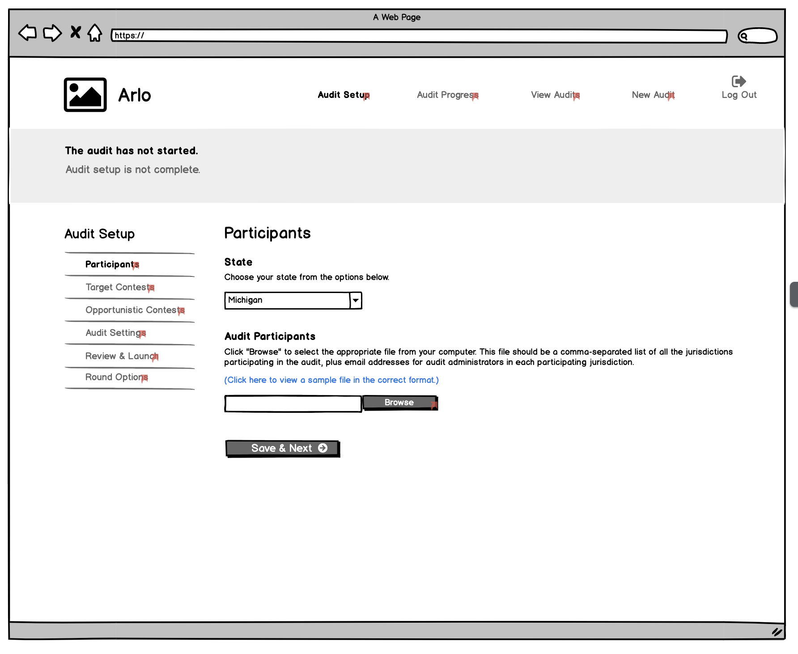

This doc proposes a new set of API endpoints for the multi-jurisdiction audit flow.

Some principles I tried to follow:

- Reuse existing routes when available
- Use REST conventions
- Avoid reusing routes across roles. Instead of reusing one route and returning different scoped responses, make different roles query different endpoints with explicit scoping in the route. That way we just have to check if a user has access to the data they are asking for, as opposed to trying to filter data based on their access. (I learned this one the hard way.)

New routes are in **bold**.

# Audit Admin: Audit setup

- GET /auth/me - get user info and all of their audits
- POST /election/new - create new audit

- PUT /election/<election_id>/jurisdiction/file - upload CSV file of jurisdictions with JAs
- GET /election/<election_id>/jurisdiction/file - download CSV file of jurisdictions with JAs

- **PUT /election/<election_id>/contest** - create/update all contests, including contest universe
- **GET /election/<election_id>/contest** - get all contests

- **GET /election/<election_id>/settings** - get audit settings (risk limit, name, etc)
- **PUT /election/<election_id>/settings** - update audit settings

- **GET /election/<election_id>/round** - get all rounds
- **POST /election/<election_id>/round** - create the first round object, if we need to
- **POST /election/<election_id>/round/<round_id>/start** - start the round, setting the sample size in the process

# Audit Admin: Running the audit

- **GET /election/<election_id>/round** - get all rounds to figure out what round we're on
- **GET /election/<election_id>/jurisdiction** - get round status for all jurisdictions

- **GET /election/<election_id>/round** - get all rounds to figure out what round we're on
- **GET /election/<election_id>/contest** - get round status for all contests

- **POST /election/<election_id>/round** - create a new round
- **POST /election/<election_id>/round/<round_id>/start** - start the new round (the backend will pick the sample size)

# Jurisdiction Admin: Audit setup

- GET /auth/me - get user info and all their audits

- PUT /election/<election_id>/jurisdiction/<jurisdiction_id>/manifest - upload the manifest (needs to be modified, since this currently initiates sampling of the ballots)

- **GET /election/<election_id>/jurisdiction/<jurisdiction_id>/round** - figure out what round we're on
- **POST /election/<election_id>/jurisdiction/<jurisdiction_id>/round/<round_id>/audit-board** - create audit boards for this round

- **GET /election/<election_id>/jurisdiction/<jurisdiction_id>/round** - list all the rounds
- **GET /election/<election_id>/jurisdiction/<jurisdiction_id>/round/<round_id>/retrieval-list** - get the retrieval list
- GET /election/<election_id>/jurisdiction/<jurisdiction_id>/round/<round_id>/ballot-list - get the ballots
