This doc proposes a new set of API endpoints for the multi-jurisdiction audit flow.

Some principles I tried to follow:

- Reuse existing routes when available
- Use REST conventions
- Avoid reusing routes across roles. Instead of reusing one route and returning different scoped responses, make different roles query different endpoints with explicit scoping in the route. That way we just have to check if a user has access to the data they are asking for, as opposed to trying to filter data based on their access. (I learned this one the hard way.)

New routes are in **bold**.

# Audit Admin: Audit setup

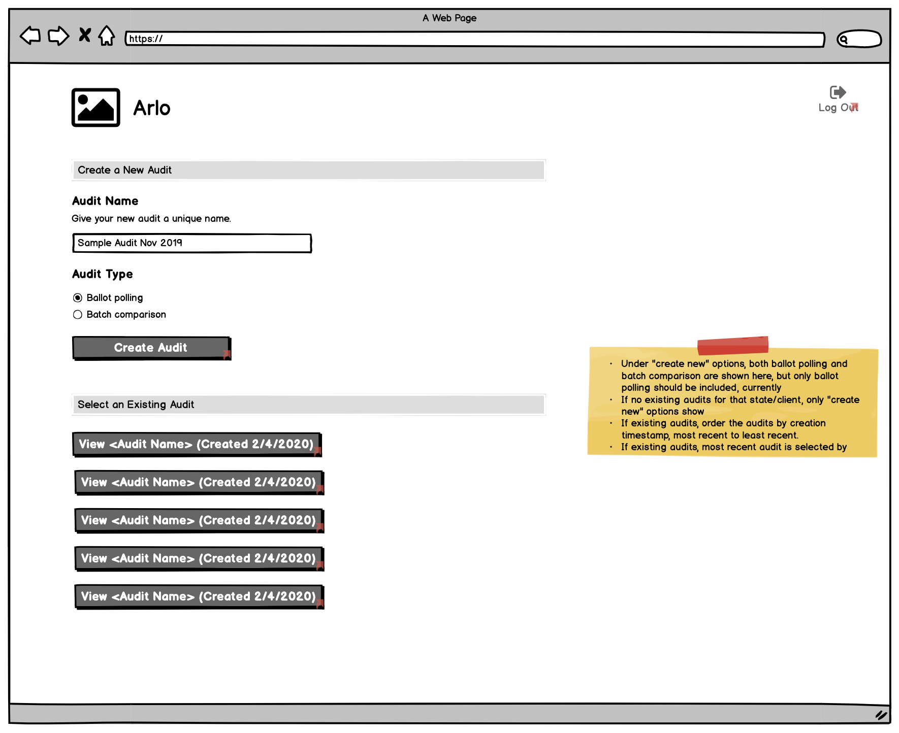

- POST /election/new - create new audit
- **GET /election** - get all audits

- POST /election/<election_id>/jurisdiction/csv - upload CSV file of jurisdictions with JAs
- GET /election/<election_id>/jurisdiction/csv - download CSV file of jurisdictions with JAs

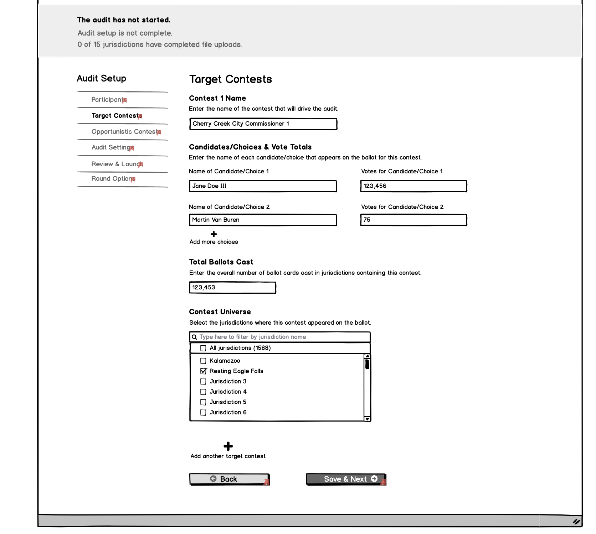

- **PUT /election/<election_id>/contests** - create/update all contests, including contest universe
- **GET /election/<election_id>/contests** - get all contests

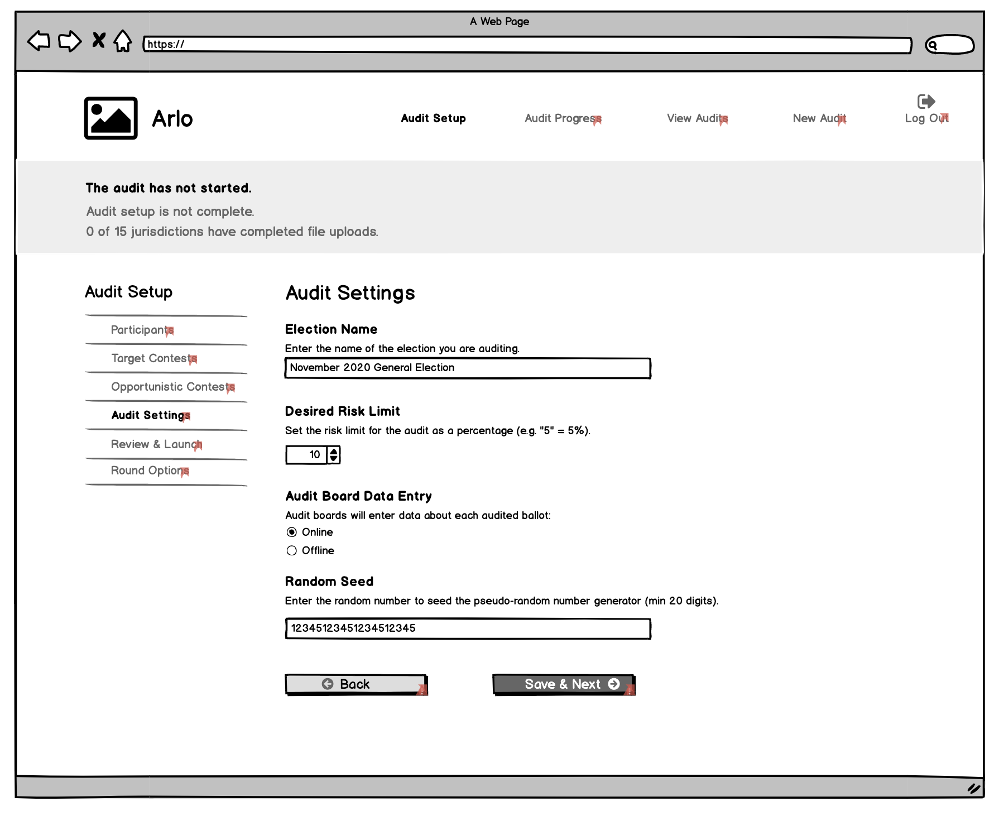

- **GET /election/<election_id>** - get audit settings (risk limit, name, etc)
- **PUT /election/<election_id>** - update audit settings

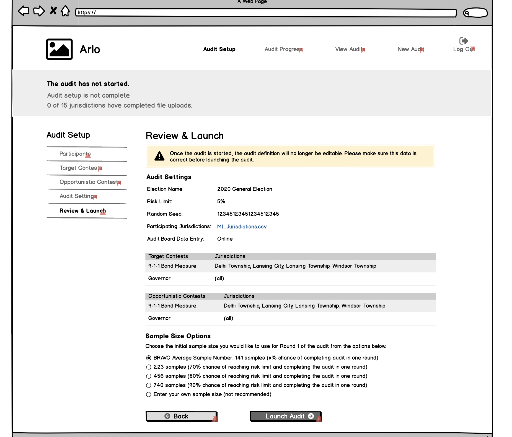

- **GET /election/<election_id>/round** - check if we have created the first round object yet
- **POST /election/<election_id>/round** - create the first round object, if we need to
- **GET /election/<election_id>/round/<round_id>** - poll the round, which will eventually have the estimated sample sizes on it
- **PUT /election/<election_id>/round/<round_id>** - set the sample size, which starts the round

# Audit Admin: Running the audit

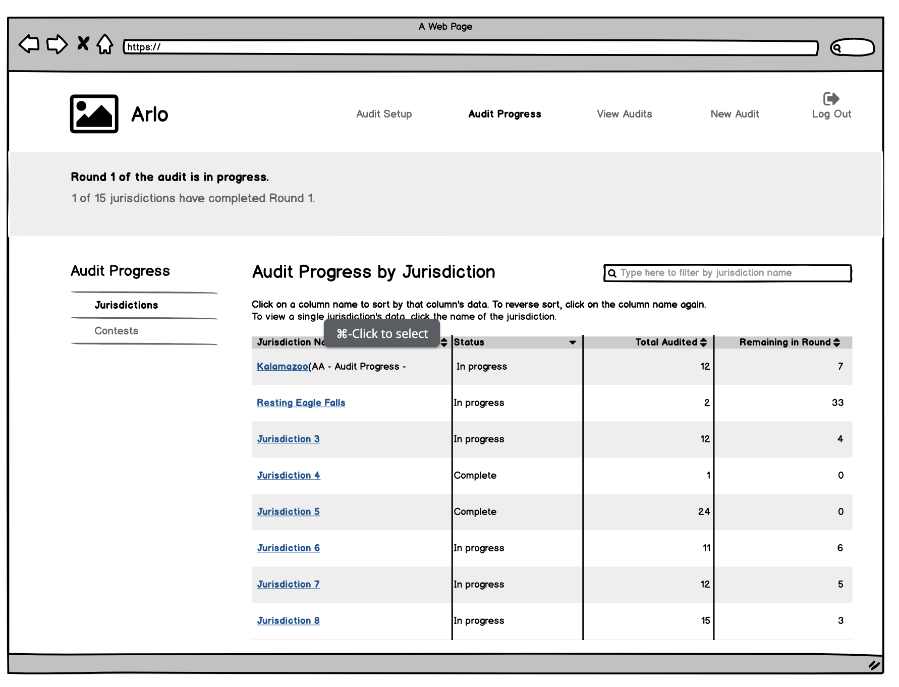

- **GET /election/<election_id>/round** - get all rounds to figure out what round we're on
- **GET /election/<election_id>/round/<round_id>/jurisdiction** - get round status by jurisdiction

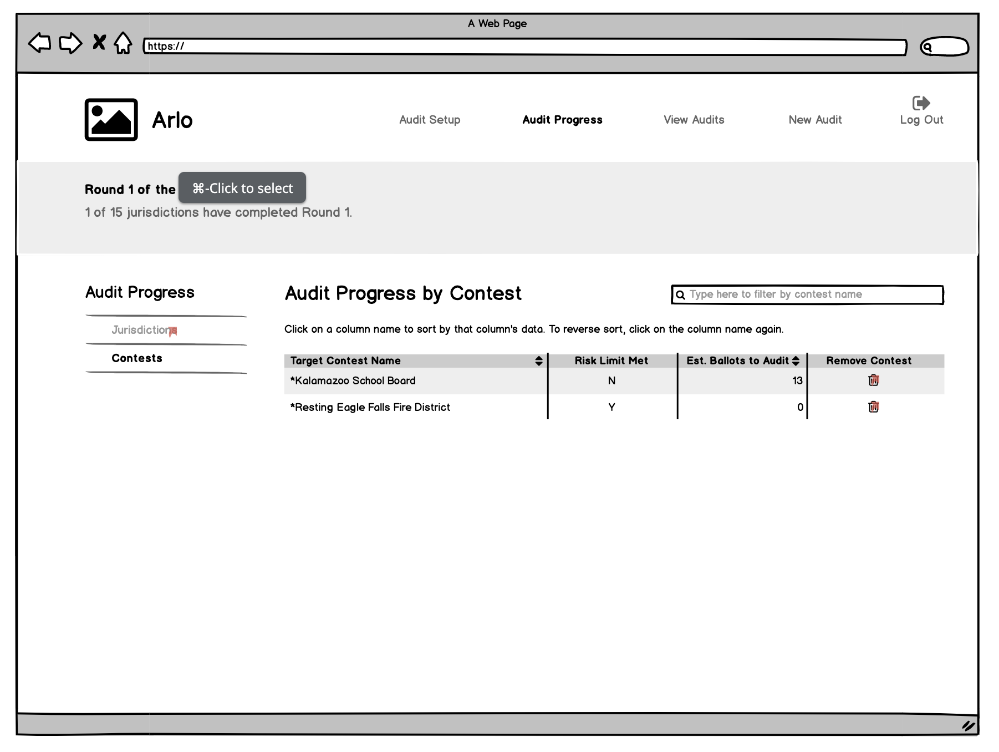

- **GET /election/<election_id>/round** - get all rounds to figure out what round we're on
- **GET /election/<election_id>/round/<round_id>/contest** - get round status by contest

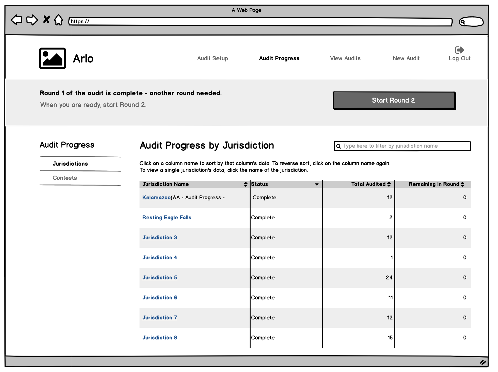

- **POST /election/<election_id>/round** - start a new round

# Jurisdiction Admin: Audit setup

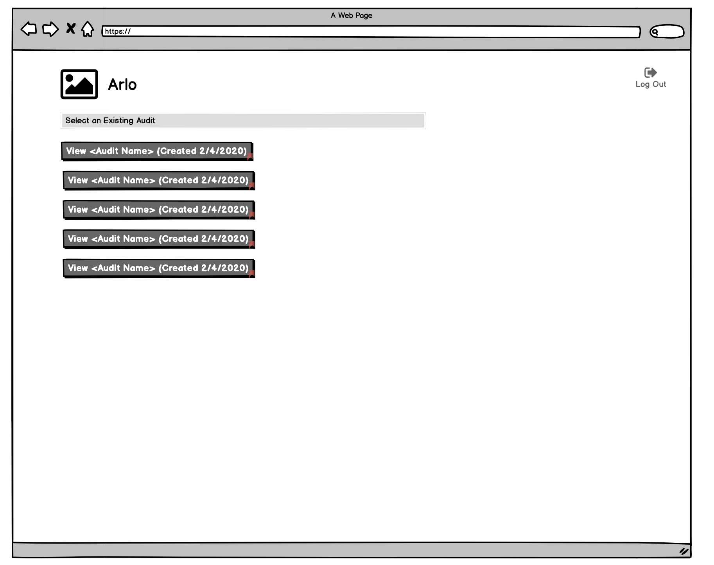

- **GET /election** - get all audits

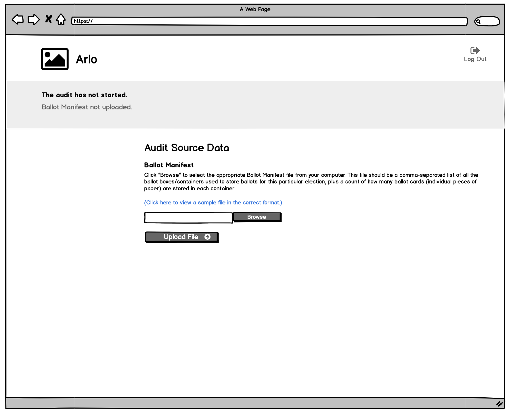

- PUT /election/<election_id>/jurisdiction/<jurisdiction_id>/manifest - upload the manifest (needs to be modified, since this currently initiates sampling of the ballots)

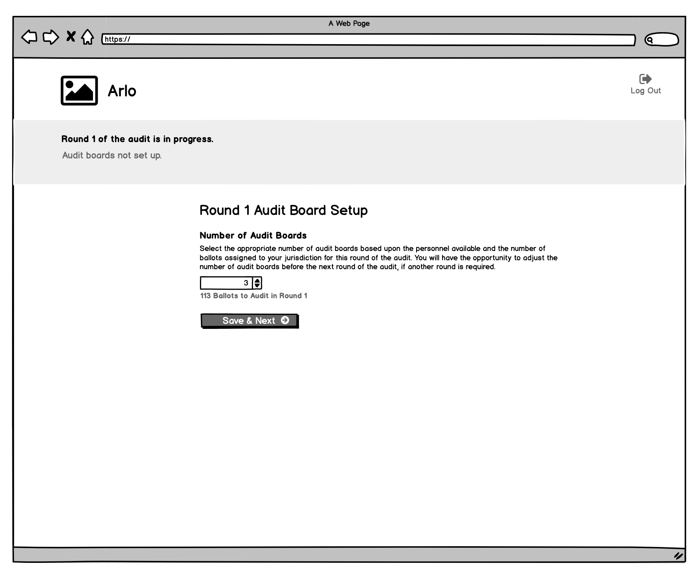

- **GET /election/<election_id>/jurisdiction/<jurisdiction_id>/round** - figure out what round we're on
- **POST /election/<election_id>/jurisdiction/<jurisdiction_id>/round/<round_id>/audit-board** - create audit boards for this round (could potentially reuse existing audit-board endpoint, but it doesn't know anything about rounds currently)

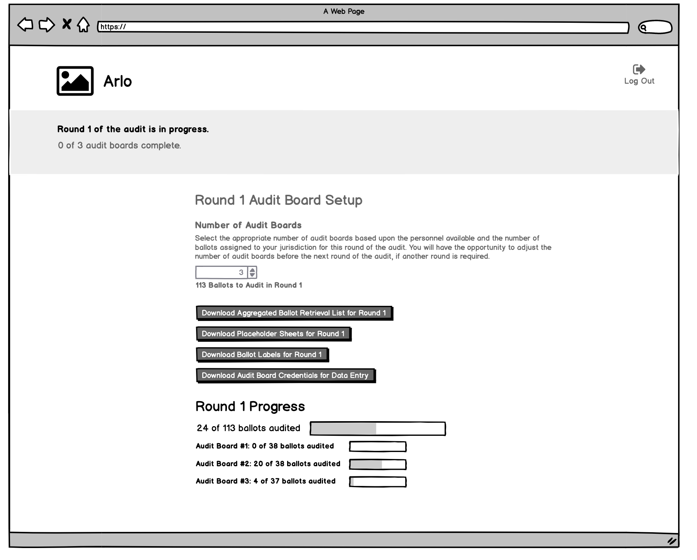

- **GET /election/<election_id>/jurisdiction/<jurisdiction_id>/round** - figure out what round we're on
- **GET /election/<election_id>/jurisdiction/<jurisdiction_id>/round/<round_id>** - get round status
- GET /election/<election_id>/jurisdiction/<jurisdiction_id>/round/<round_id>/retrieval-list - get the retrieval list (technically the existing endpoint is /election/<election_id>/jurisdiction/<jurisdiction_id>/<round_num>/retrieval-list, which is painfully inconsistent, but I guess we can reuse it)
- GET /election/<election_id>/jurisdiction/<jurisdiction_id>/round/<round_id>/ballot-list - get the ballots
